# Andryusha and Colored Balloons


## Entrada

```text
8
1 2
1 3
1 4
2 5
2 6
3 7
7 8
```

Cada línea representa una conexión entre dos nodos.

Por ejemplo:

```text
1 2
```

significa que existe una arista entre el nodo `1` y el nodo `2`.

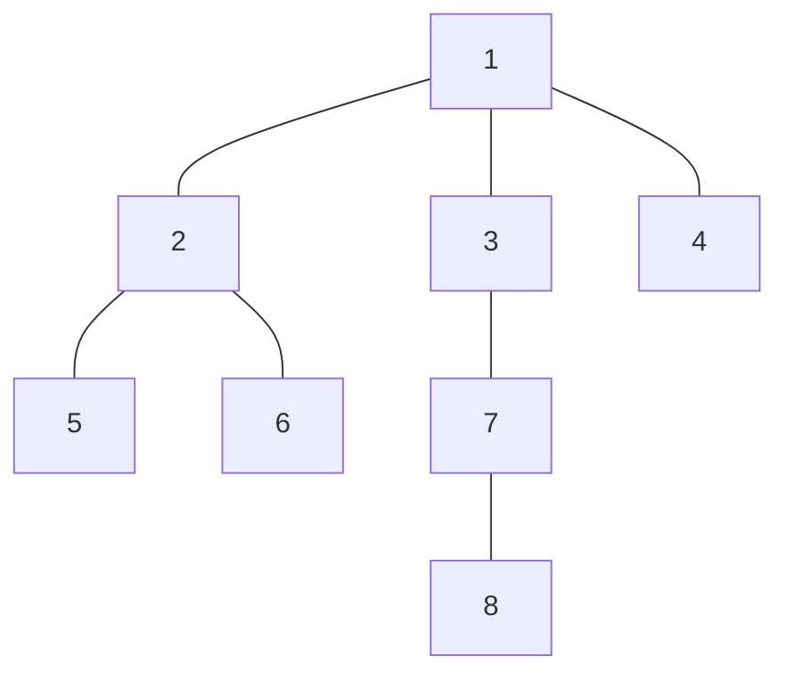

---

# Paso 0: construir la lista de adyacencia

## Paso 0.1: declarar el arreglo de listas

```java
ArrayList<Integer>[] adj = new ArrayList[N];
```

Esta línea crea un arreglo llamado `adj`.

Cada posición del arreglo podrá almacenar una lista de vecinos.

Al principio, todas las posiciones contienen `null`.

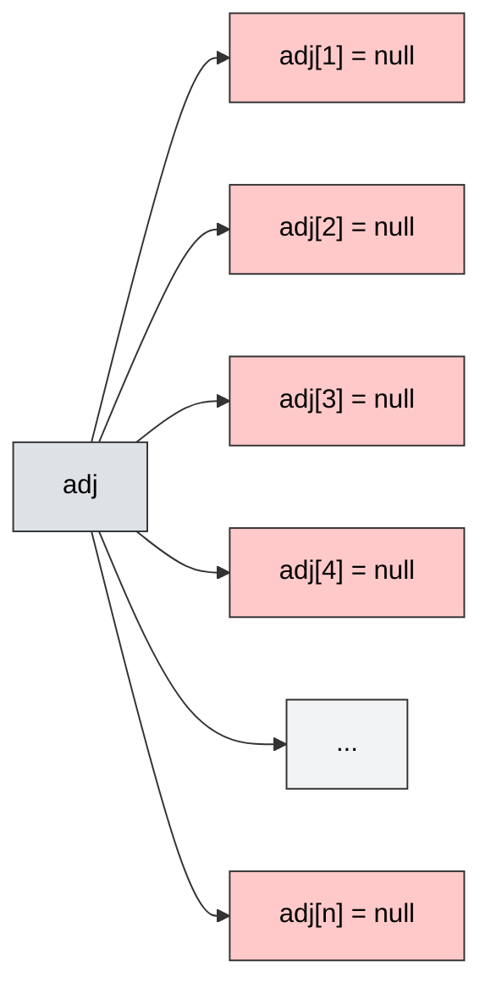

La declaración crea el arreglo adj

Por eso, antes de usar:

```java
adj[1].add(2);
```

---

## Paso 0.2: crear una lista vacía para cada nodo

```java
for (int i = 1; i <= n; i++) {
    adj[i] = new ArrayList<>();
}
```


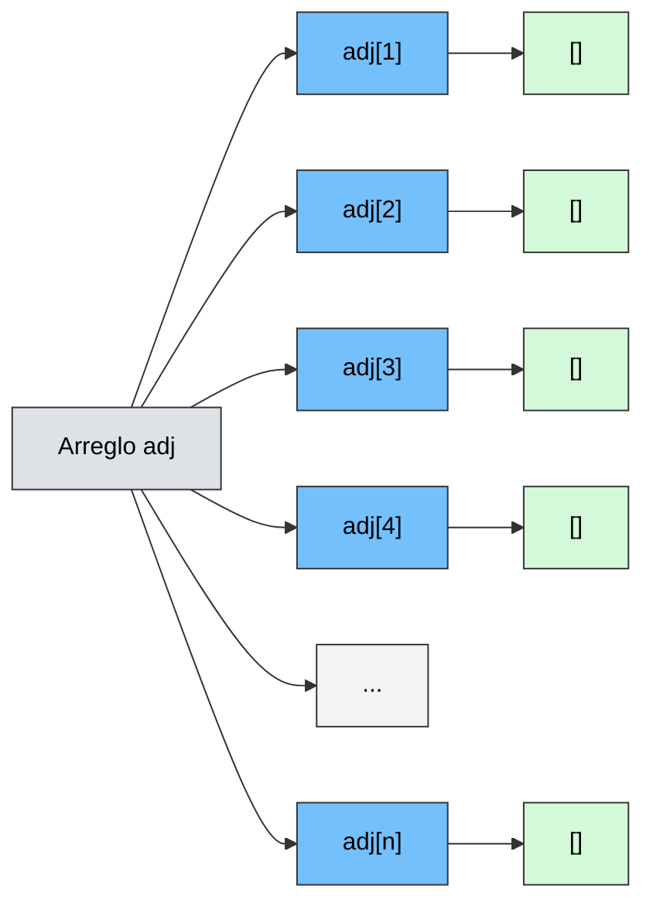

Para `n = 8`, inicialmente tenemos:

```text
adj[1] -> []
adj[2] -> []
adj[3] -> []
adj[4] -> []
adj[5] -> []
adj[6] -> []
adj[7] -> []
adj[8] -> []
```

---

## Paso 0.3: leer las aristas

El árbol tiene `n-1` aristas.

```java
for (int i = 1; i < n; i++) {
    int u = scanner.nextInt();
    int v = scanner.nextInt();

    adj[u].add(v);
    adj[v].add(u);
}
```

El árbol es no dirigido, por eso, cada conexion debe almacenarse en ambos sentidos


```text
1 2
```

se ejecuta:

```java
adj[1].add(2);
adj[2].add(1);
```

Esto significa:

```text
El nodo 1 tiene como vecino al nodo 2.
El nodo 2 tiene como vecino al nodo 1.
```

---

## Paso 0.4: lista de adyacencia resultante


| Nodo | Vecinos |
| ---: | ------- |
|    1 | 2, 3, 4 |
|    2 | 1, 5, 6 |
|    3 | 1, 7    |
|    4 | 1       |
|    5 | 2       |
|    6 | 2       |
|    7 | 3, 8    |
|    8 | 7       |

La estructura queda:

```text
adj[1] = [2, 3, 4]
adj[2] = [1, 5, 6]
adj[3] = [1, 7]
adj[4] = [1]
adj[5] = [2]
adj[6] = [2]
adj[7] = [3, 8]
adj[8] = [7]
```

Ahora el árbol ya puede recorrerse con DFS.

---

# Paso 1: determinar la cantidad de colores

Los colores se representan mediante numeros

| # | color |
| -----: | --------------------- |
|      1 | Rojo                  |
|      2 | Azul                  |
|      3 | Verde                 |
|      4 | Amarillo              |

---

## Grado de un nodo

El grado de un nodo es la cantidad de vecinos que tiene.

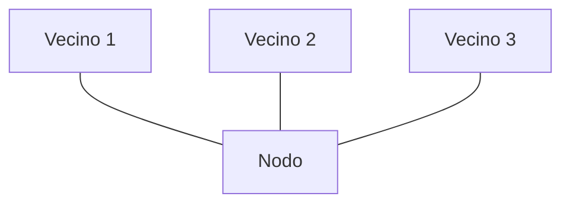


```text
grado(nodo) = 3
```


| Nodo | Grado |
| ---: | ----: |
|    1 |     3 |
|    2 |     3 |
|    3 |     2 |
|    4 |     1 |
|    5 |     1 |
|    6 |     1 |
|    7 |     2 |
|    8 |     1 |

El grado máximo es `3`.

La cantidad mínima de colores es:

```text
totalColors = grado máximo + 1
```

En este árbol:

```text
totalColors = 3 + 1
totalColors = 4
```

---

# Paso 2: DFS desde el nodo 1

El nodo raíz recibe el color `1`.

Visualmente lo representaremos como rojo.

```java
color[1] = 1;
dfs(1, 1, 0);
```


```text
Nodo actual: 1
Color actual: 1
Color del padre: 0
```

El valor `0` significa que el nodo raíz no tiene padre.

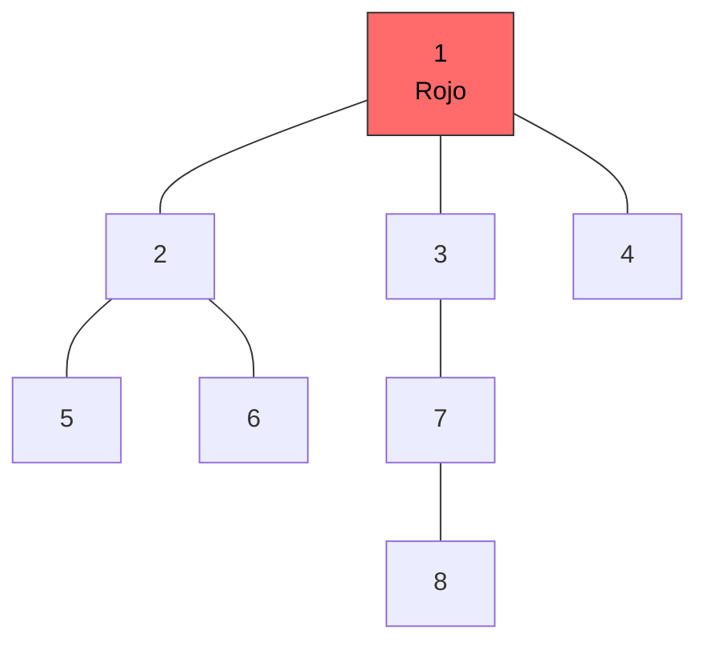

---

# Regla del problema

El enunciado establece que:

> Si `a`, `b` y `c` son nodos distintos, `a` está conectado directamente con `b` y `b` está conectado directamente con `c`, entonces los tres nodos deben tener colores diferentes.

Esto representa un camino de tres nodos:

```text
a -> b -> c
```

En el DFS puede interpretarse como:

```text
abuelo -> padre -> hijo
```

Por eso, al colorear a un hijo, no se pueden usar:

```text
1. El color de su padre.
2. El color de su abuelo.
```

Además, los hermanos deben recibir colores diferentes.

---

# Paso 3: colorear al nodo 2

Los vecinos del nodo `1` son:

```text
2, 3, 4
```

El código recorre estos vecinos en orden.

Primero encuentra al nodo `2`.

El nodo `2` recibe amarillo:

```text
Nodo 2 = amarillo
```

En este momento, los nodos `3` y `4` todavía no fueron coloreados.

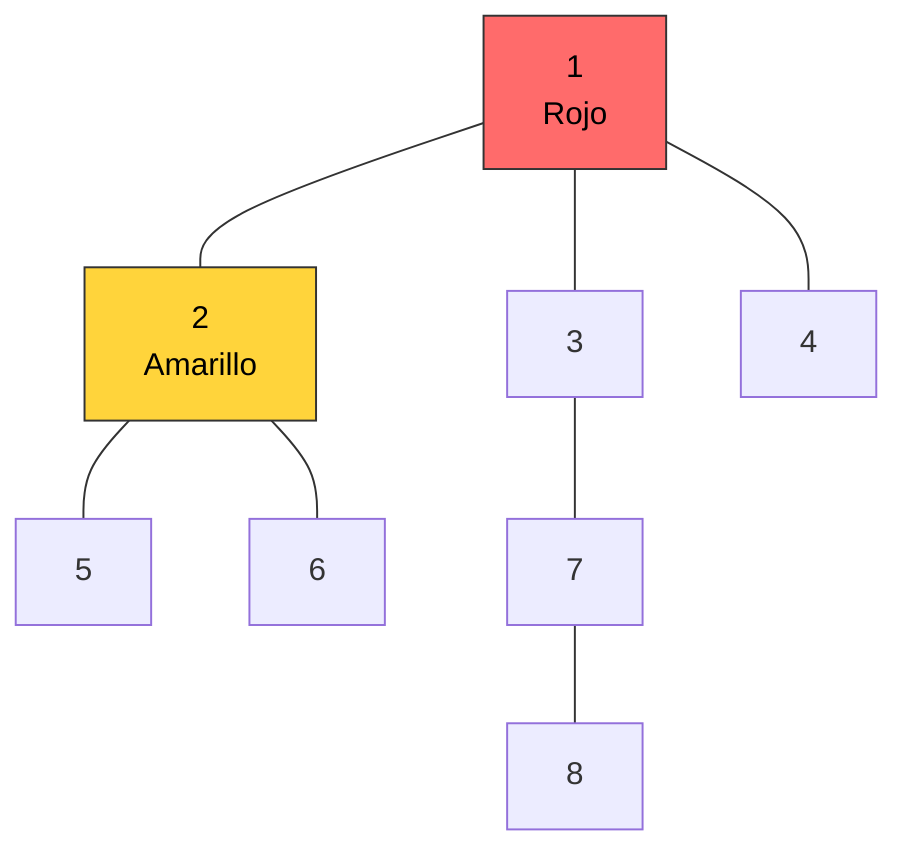

Después de colorear al nodo `2`, el DFS entra inmediatamente en él.

```java
dfs(2, color[2], color[1]);
```

Sustituyendo los valores:

```java
dfs(2, 4, 1);
```

Esto significa:

```text
Nodo actual: 2
Color actual: 4, amarillo
Color de su padre: 1, rojo
```

El recorrido hasta ahora es:

```text
1 -> 2
```

---

# Paso 4: procesar el nodo 2

El nodo `2` es amarillo y su padre es el nodo `1`, que es rojo.

```text
1 rojo -> 2 amarillo
```

Los vecinos del nodo `2` son:

```text
1, 5, 6
```

El nodo `1` ya fue visitado.

Por tanto, los vecinos pendientes son:

```text
5 y 6
```


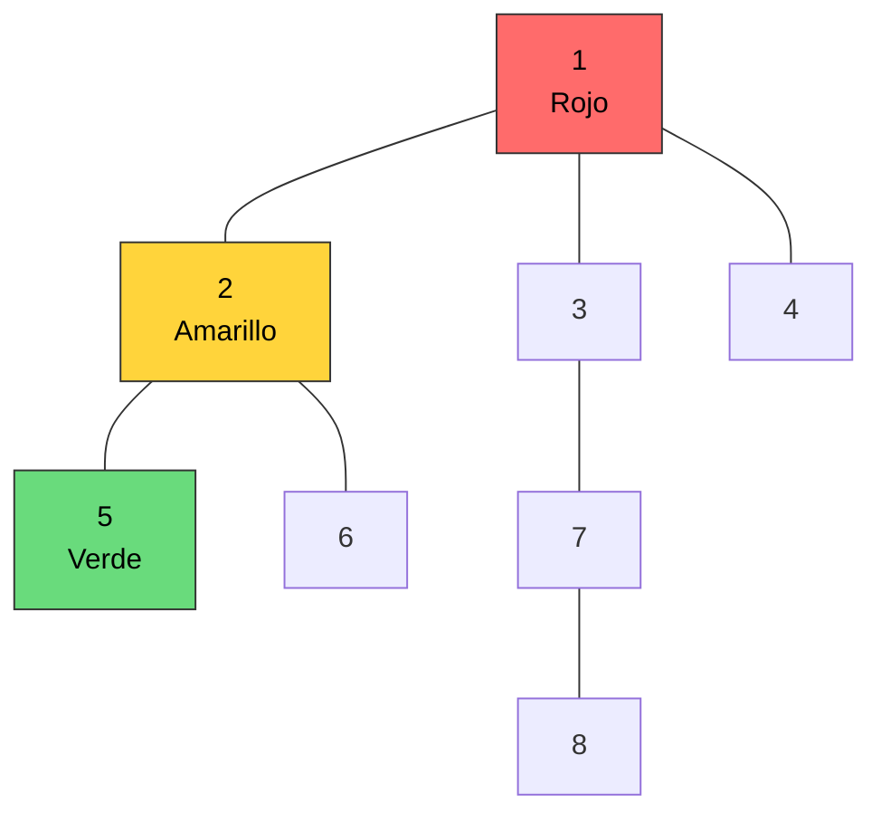

Después, el DFS entra inmediatamente al nodo `5`.

```text
1 -> 2 -> 5
```

---

# Paso 5: llegar al nodo 5

Los vecinos del nodo `5` son:

```text
adj[5] = [2]
```

Su único vecino es el nodo `2`.

Pero el nodo `2` ya fue visitado.

Por tanto, el nodo `5` no tiene vecinos pendientes.

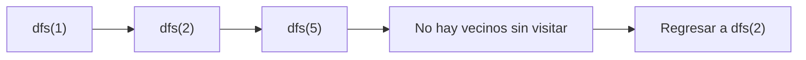

La llamada termina:

```text
dfs(5) termina
```

---

# Paso 6: colorear al nodo 6

El DFS continúa recorriendo los vecinos del nodo `2`.

Ahora encuentra al nodo `6`.

El nodo `6` recibe azul:

```text
Nodo 6 = azul
```

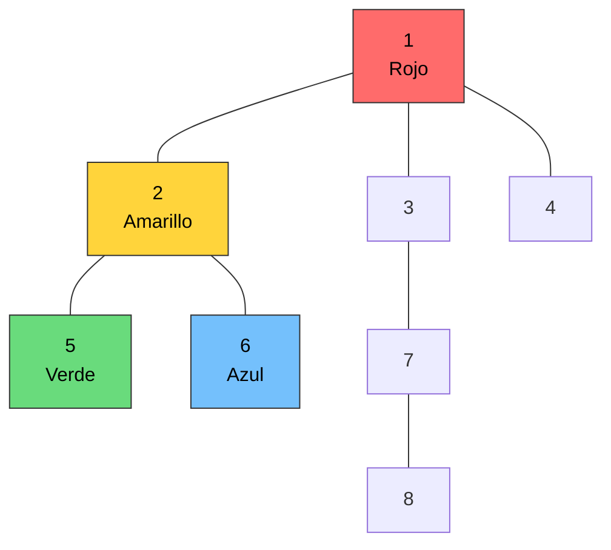

El recorrido es:

```text
1 -> 2 -> 6
```

Los vecinos del nodo `6` son:

```text
adj[6] = [2]
```

El nodo `2` ya fue visitado.


```text
dfs(6) termina
```

El programa regresa a `dfs(2)`.

Como el nodo `2` ya no tiene más vecinos pendientes:

```text
dfs(2) termina
```

El DFS regresa al nodo `1`.

---

# Paso 7: continuar desde el nodo 1

El recorrido realizado hasta ahora es:

```text
1
|
+-- 2
    |
    +-- 5
    |   |
    |   +-- regresar
    |
    +-- 6
        |
        +-- regresar
```

El DFS regresa al nodo `1` y continúa con el siguiente vecino:

```text
Nodo 3
```

El nodo `3` recibe verde:

```text
Nodo 3 = verde
```

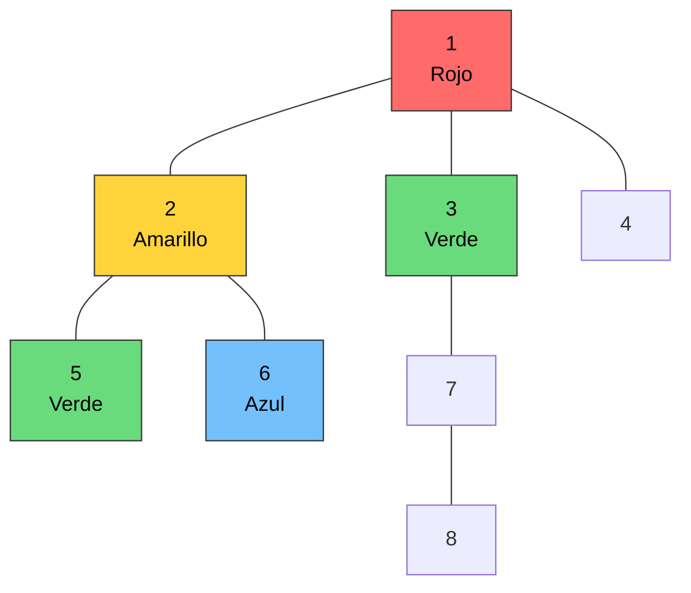

Después, el DFS entra al nodo `3`.

```text
1 -> 3
```

---

# Paso 8: procesar el nodo 3

El nodo `3` es verde y su padre es el nodo `1`, que es rojo.

```text
1 rojo -> 3 verde
```

Los vecinos del nodo `3` son:

```text
1 y 7
```

El nodo `1` ya fue visitado.

Solo queda procesar al nodo `7`.

El nodo `7` no puede usar:

```text
Verde, porque es el color de su padre.
Rojo, porque es el color de su abuelo.
```

Los colores disponibles son:

```text
Azul
Amarillo
```

El nodo `7` recibe amarillo.

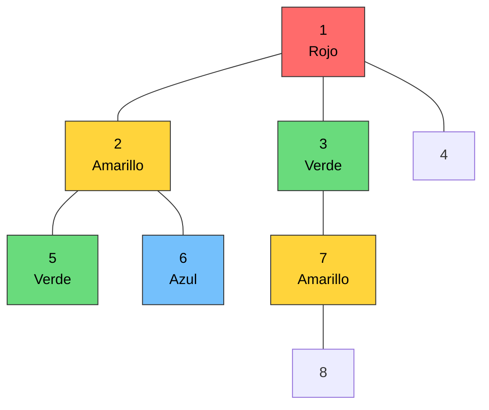

El camino:

```text
1 rojo -> 3 verde -> 7 amarillo
```

tiene tres colores diferentes.

El DFS continúa:

```text
1 -> 3 -> 7
```

---

# Paso 9: procesar el nodo 7

El nodo `7` es amarillo y su padre es el nodo `3`, que es verde.

```text
3 verde -> 7 amarillo
```

Los vecinos del nodo `7` son:

```text
3 y 8
```

El nodo `3` ya fue visitado.

Por tanto, falta procesar al nodo `8`.

El nodo `8` no puede usar:

```text
Amarillo, porque es el color de su padre.
Verde, porque es el color de su abuelo.
```

Los colores disponibles son:

```text
Rojo
Azul
```

El nodo `8` recibe azul.

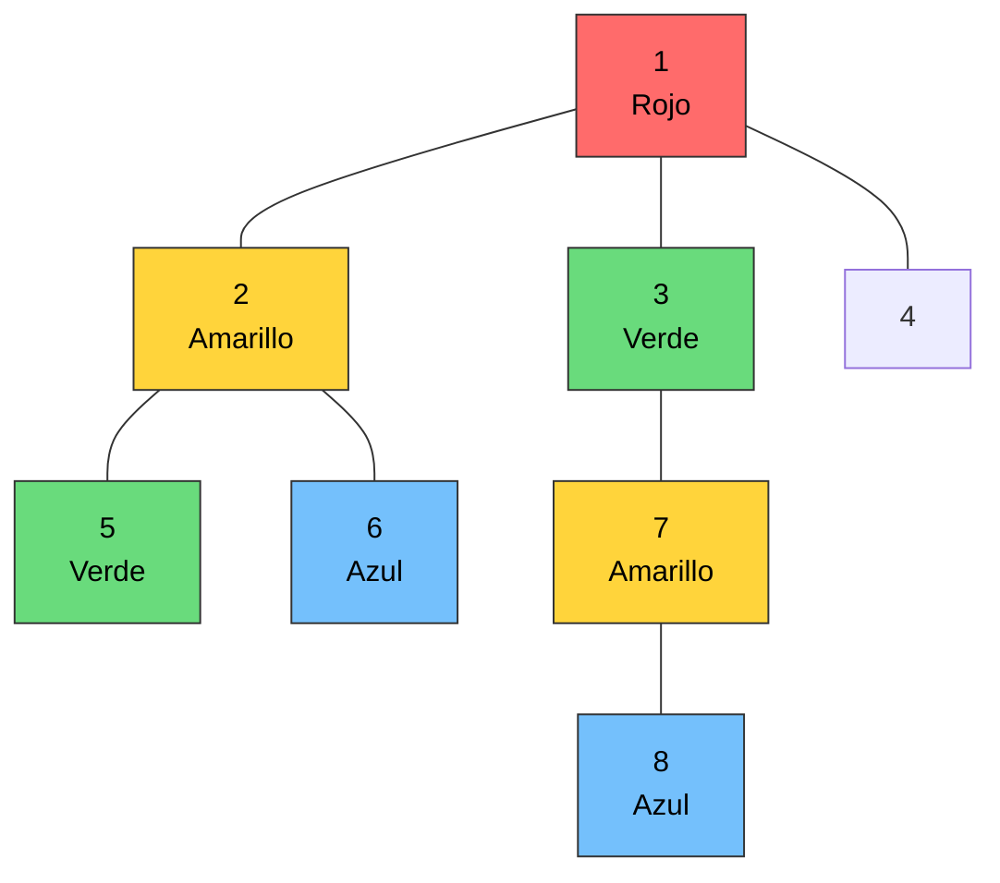

El camino:

```text
3 verde -> 7 amarillo -> 8 azul
```

tiene tres colores diferentes.

El nodo `8` es una hoja.

Por tanto:

```text
dfs(8) termina
dfs(7) termina
dfs(3) termina
```

El DFS regresa al nodo `1`.

---

# Paso 10: procesar el nodo 4

Después de regresar al nodo `1`, queda un último vecino pendiente:

```text
Nodo 4
```

El nodo `4` recibe azul:

```text
Nodo 4 = azul
```

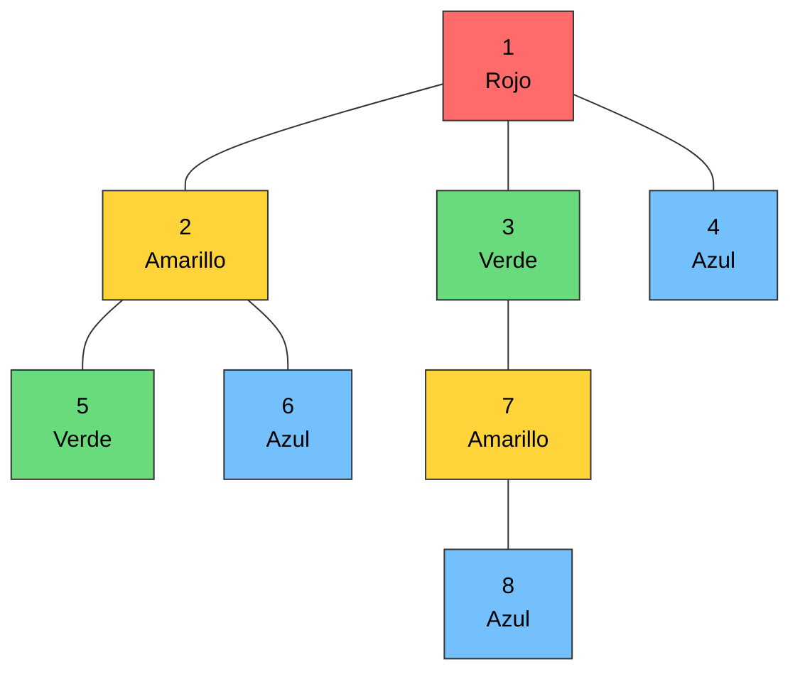

El nodo `4` tiene como único vecino al nodo `1`.

Como el nodo `1` ya fue visitado:

```text
dfs(4) termina
```

Finalmente:

```text
dfs(1) termina
```

---

# Orden de primera visita

El orden en el que los nodos se visitan por primera vez es:

```text
1 -> 2 -> 5 -> 6 -> 3 -> 7 -> 8 -> 4
```

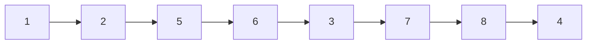

---

# Recorrido DFS

El movimiento real incluye entradas y retornos:

```text
1
-> 2
   -> 5
   <- 2
   -> 6
   <- 2
<- 1
-> 3
   -> 7
      -> 8
      <- 7
   <- 3
<- 1
-> 4
<- 1
```

En una sola línea:

```text
1 -> 2 -> 5 -> 2 -> 6 -> 2 -> 1 -> 3 -> 7 -> 8 -> 7 -> 3 -> 1 -> 4 -> 1
```

---

# Ans

```text
4
1 4 3 2 3 2 4 2
```

| Nodo | Color  | Color    |
| ---: | -------------: | -------- |
|    1 |              1 | Rojo     |
|    2 |              4 | Amarillo |
|    3 |              3 | Verde    |
|    4 |              2 | Azul     |
|    5 |              3 | Verde    |
|    6 |              2 | Azul     |
|    7 |              4 | Amarillo |
|    8 |              2 | Azul     |

---


# Codigo

```java=
import java.util.ArrayList;
import java.util.Scanner;
import java.util.Stack;

public class CF781A2 {

    static final int N = 200010;

    static int[] color = new int[N];
    static boolean[] visited = new boolean[N];
    static ArrayList<Integer>[] adj = new ArrayList[N];

    static int totalColors;

    public static void dfs(int node, int currentColor, int parentColor) {

        visited[node] = true;

        Stack<Integer> availableColors = new Stack<>();

        for (int pColor = 1; pColor <= totalColors; pColor++) {

            /*
             * Verificar si se puede utilizar el color pColor
             *
             * El color debe ser diferente al color actual y al padre
             * Si cumple la condicion se agrega
             */

            if (availableColors.size() == adj[node].size()) {
                break;
            }
        }

        //Recorremos todos los nodos del node
        for (int i = 0; i < adj[node].size(); i++) {

            int child = adj[node].get(i);

            if (!visited[child]) {

                /*
                 * Extraer un color disponible de la pila y asignar al child
                 * availableColors.pop()
                 */

                /*
                 * Llamar recursivamente al DFS.
                 */
            }
        }
    }

    public static void main(String[] args) {

        Scanner scanner = new Scanner(System.in);

        int n = scanner.nextInt();

        for (int i = 1; i <= n; i++) {
            adj[i] = new ArrayList<>();
        }

        for (int i = 1; i < n; i++) {

            int u = scanner.nextInt();
            int v = scanner.nextInt();

            adj[u].add(v);
            adj[v].add(u);
        }

        totalColors = 0;

        for (int i = 1; i <= n; i++) {

            int totalNodeSize = adj[i].size();

            totalColors = Math.max(
                    totalColors,
                    totalNodeSize + 1);
        }
        //Se asigna el primero color al node raiz
        color[1] = 1;

        dfs(1, color[1], 0);

        System.out.println(totalColors);

        //print de los colores
    }
}
```